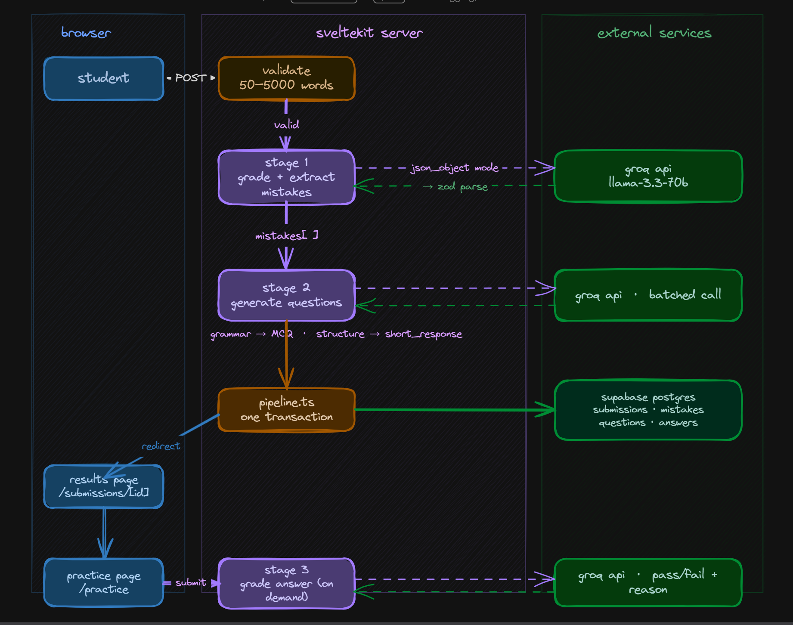

# essaylab

**Live:** https://essaylab-grd.vercel.app  
Student pastes essay → AI flags mistakes with exact quotes → generates personalized practice questions from those mistakes. No numeric grade, ever.

Built while applying to [Gradr](https://gradr.se) — several decisions here mirror their public engineering stance.

---

## Stack
SvelteKit · TypeScript · PostgreSQL (Supabase) · Groq

---

## Pipeline

```
essay text
  → [Stage 1] grade + extract mistakes  (1 Groq call)
  → [Stage 2] group by category + generate questions  (1 batched Groq call)
  → persist in one DB transaction
  → results page → practice page
  → [Stage 3] grade short-response answers on demand  (1 Groq call per answer)
```

Grammar categories → MCQ. Structure/argument categories → short written response. This routing is deterministic in application code — the model never decides it.

---

## Architecture Design



---

## Decisions worth explaining

**One call per stage, not one big prompt.** A single prompt doing everything produces unreliable structured output. Splitting gives each call a narrow schema, isolated failures, and easier prompt tuning.

**Zod at every AI boundary.** Groq's `json_object` mode is not schema-validated. Every response is `unknown` until it passes `.safeParse()`. Types are inferred from schemas with `z.infer<>` — no hand-written parallel types that can drift.

**Fixed 8-category enum.** Categories live as a Postgres check constraint, a TS literal union, and an explicit prompt instruction simultaneously. Makes aggregation trivial and rules out schema drift. Tradeoff: a real mistake outside the 8 goes unflagged.

**Questions grouped by category, not per mistake instance.** Three comma splices → 1-2 representative questions, not 3 identical ones. Grouping is pure app logic before Stage 2.

**Feedback not a grade.** Mirrors Gradr's own stance — final grading is a human decision both pedagogically and (in some jurisdictions) legally.

---

## Problems hit

- `llama-3.3-70b-versatile` doesn't support `json_schema` mode, only `json_object` — so Zod is the actual validation gate, not the API
- Supabase typed client silently degrades to `never` with `interface` row types — fixed by switching to `type` aliases
- Stage 1 occasionally returns hallucinated category names — dropped server-side before DB insert, never crash the pipeline
- Model sometimes paraphrases instead of exact-quoting — logged, not fatal
- Svelte 5 `$effect` re-ran on every reactive change and overwrote answer state mid-typing — fixed with `untrack()` on the DB fetch

---

## Not here (deliberately)
File upload · Auth · Rate limiting · Numeric grades 